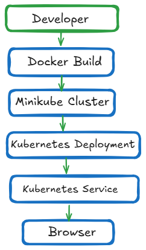
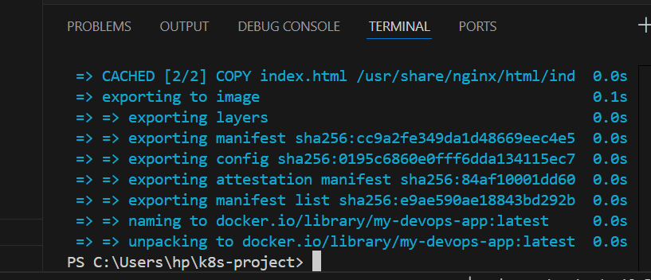
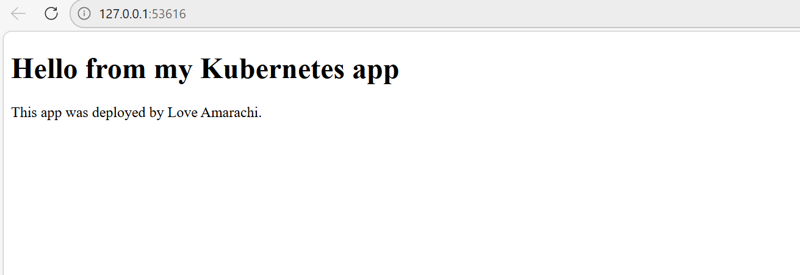

# Kubernetes DevOps Demo
# Kubernetes DevOps Demo


Dockerized web application deployed on Kubernetes using Minikube.  
This project demonstrates container builds, Kubernetes deployments, service exposure, scaling, and self-healing behavior.
## Project Overview

This project demonstrates how to deploy and operate a containerized web application on Kubernetes using Minikube.

The workflow covers the full lifecycle of a simple cloud-native application:

* Build a Docker image for the application
* Run a local Kubernetes cluster with Minikube
* Deploy the application using Kubernetes Deployment manifests
* Expose the application through a Kubernetes Service
* Verify pods and access the application through the browser

The goal of this project is to practice the core DevOps workflow of building, deploying, scaling, and operating containerized applications on Kubernetes.
## Project Features

Dockerized web application

Kubernetes deployment with multiple pods

Service exposure using NodePort

Application scaling demonstration

Kubernetes self-healing test

## Architecture


## Technology Stack

- Docker
- Kubernetes
- Minikube
- kubectl
- Git
- Visual Studio Code
## Quick Start

### 1 Start Minikube

```bash
minikube start
```

### 2 Build Docker Image

```bash
docker build -f docker/Dockerfile -t my-devops-app .
```

### 3 Deploy to Kubernetes

```bash
kubectl apply -f k8s/deployment.yaml
kubectl apply -f k8s/service.yaml
```

### 4 Verify the Pods

```bash
kubectl get pods
```

### 5 Access the Application

```bash
minikube service nginx-service
```
## Screenshots

### Docker Build Output



### Kubernetes Pods Running


### Application Running in Browser


## Project Roadmap

Planned improvements to expand this project into a more production-like DevOps workflow:

* Add Helm charts for packaging Kubernetes deployments
* Implement ArgoCD for GitOps based deployment management
* Integrate Prometheus for cluster and application monitoring
* Add Grafana dashboards for visualization and observability
* Introduce CI/CD automation for building and deploying the application
* Expand troubleshooting and operational documentation
